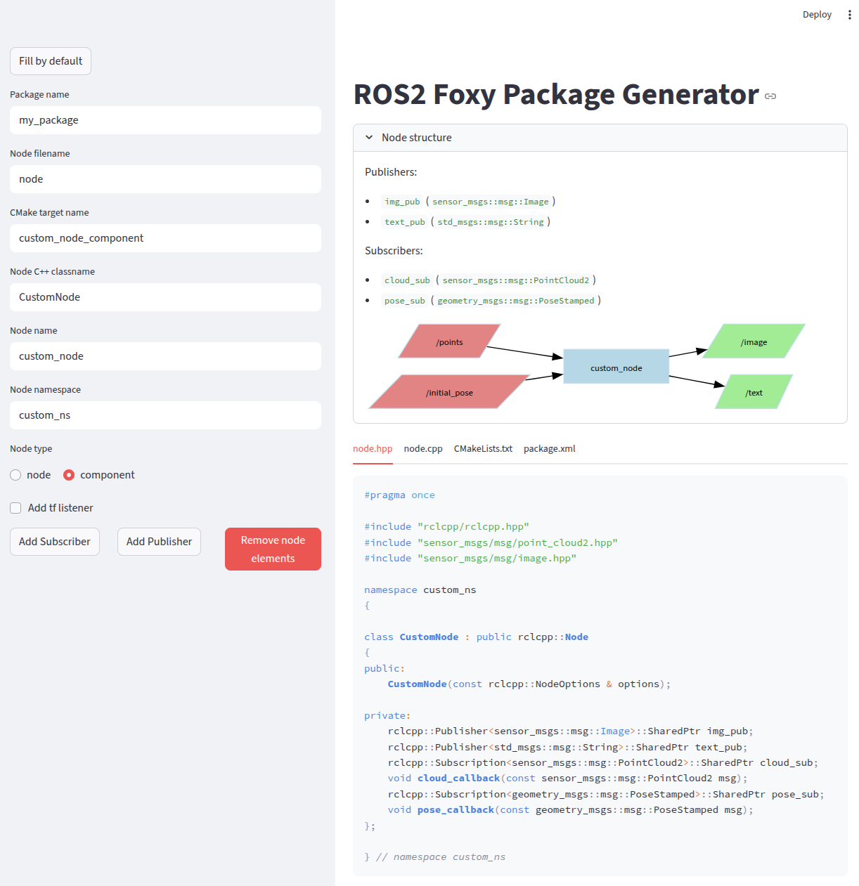

# ROS2 Package Generator

Tool for quickly creating ROS2 Foxy packages with C++ node



### Install

Clone repo:
```bash
git clone https://github.com/tamerlan-b/ros2-package-generator.git
```

Create virtual environment:
```bash
python3 -m venv ros2-env
source ros2-env/bin/activate
```

Install deps:
```bash
cd ros2-package-generator
pip install -r requirements.txt
```

### Launch

```bash
streamlit run ros2_package_generator.py
```

### TODO
- [x] Add the ability to edit publishers and subscribers
- [ ] Update README
- [ ] Add support for:
  - [x] ros2-params
  - [ ] ros2-timers
  - [ ] ros2-service
  - [ ] ros2-actions
  - [ ] message_filters
- [ ] Support newer ROS2 distros (humble, iron, jazzy, kilted)
- [ ] Add download button for generated files
- [ ] Visualize package structure (with directories)


