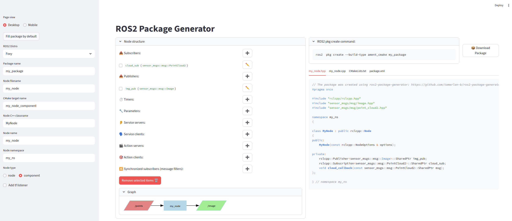

# ROS2 Package Generator

Tool for quickly creating ROS2 Foxy packages with C++ node



### Features

##### ⚡ **Instant Generation**
Complete ROS2 package with proper structure (CMakeLists.txt, package.xml, .hpp, .cpp files) created in seconds with one click.

##### 📝 **Zero Boilerplate Code**
Automatic generation of all template constructs. No more manual writing of:
- Classes inheriting from `rclcpp::Node`
- Publisher/subscriber declarations
- Constructor initialization
- Callback functions
- Node parameters

##### 🔄 **All ROS2 Component Types**
Support for all major ROS2 node elements:
- [x] **📤 Publishers** (with QoS, topic, message type configuration)
- [x] **📥 Subscribers** (with auto-generated callback functions)
- [x] **🔧 Services** (servers and clients)
- [x] **⏱️ Timers** (periodic callbacks)
- [x] **⚙️ Parameters** (declaration and initialization)
- [x] **🎯 Actions** (action servers)

##### 🎨 **Visual Constructor**
Intuitive interface for:
- Adding and removing components
- Configuring each element's properties
- Real-time preview of generated code

##### 📊 **Automatic Dependency Resolution**
Smart system that:
- Automatically adds `find_package()` to CMakeLists.txt
- Includes necessary header files
- Forms correct dependencies in package.xml

##### 🔍 **Code Preview**
Live preview of all generated files:
- Node `.hpp` file
- Implementation `.cpp` file
- CMakeLists.txt
- package.xml

##### ⚡ **One-Click Export**
Ready-to-use package structure:
- 📦 **ZIP archive** with complete ROS2 package structure
- 📁 **Automatic structure**:
  ```
  my_package/
  ├── include/my_package/node.hpp
  ├── src/node.cpp
  ├── CMakeLists.txt
  ├── package.xml
  └── README.md
  ```
- 🚀 **Build-ready** with `colcon build`

### Install

Clone repo:
```bash
git clone https://github.com/tamerlan-b/ros2-package-generator.git
```

Create virtual environment:
```bash
python3 -m venv ros2-env
source ros2-env/bin/activate
```

Install deps:
```bash
cd ros2-package-generator
pip install -r requirements.txt
```

### Launch

```bash
streamlit run ros2_package_generator.py
```

### TODO
- [x] Add the ability to edit publishers and subscribers
- [x] Update README
- [ ] Add support for:
  - [x] ros2-params
  - [x] ros2-timers
  - [x] ros2-service
  - [x] ros2-actions
  - [ ] message_filters
- [ ] Support newer ROS2 distros (humble, iron, jazzy)
- [x] Add download button for generated files
- [ ] Visualize package structure (with directories)


